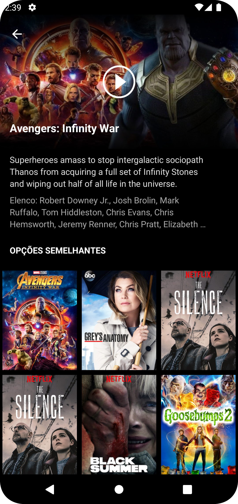

<h1 align="center">
  Netflix Clone Android
</h1>

  
  

## 💻 Sobre o projeto

Esse clone do app Android da Netflix visa colocar em prática todos os conceitos de layout moderno utilizando Kotlin junto com XML, além de uma integração com uma API externa que faz a listagem dos filmes. Uma aplicação simples usada apenas para aprendizado.

## ⚙️ Funcionalidades

- Listagem dos filmes em uma tela principal
- Ao clicar em um dos filmes o usuário é redirecionado a uma outra tela que traz os detalhes daquele filme

## 🛠 Tecnologias

As seguintes ferramentas foram usadas na construção do projeto:

- Kotlin
- XML (Layout)

## 💡 O que eu aprendi

- Utilizar drawables personalizados e adicionar gradientes a eles
- Manipulação de lista (RecyclerView)
- Usar componentes como: Toolbar, ProgressBar e etc
- Manipular as dimensões da ImageView utilizando o **constraintDimensionRatio**
- Sincronizar uma ScrollView com uma ou mais RecyclerView dentro (NestedScrollView)
- Organização de arquivos e separação de responsabilidades
- Integração com uma api externa sem a utilização de frameworks
- Download de imagens sem a utilização de frameworks
- Assincronismo com o **Executors**

## 🚀 Como executar o projeto

1. Antes de tudo tenha certeza que você tem o ambiente java configurado na sua máquina.
2. Depois clone o projeto
3. Agora basta abrir o projeto no Android Studo e rodar
